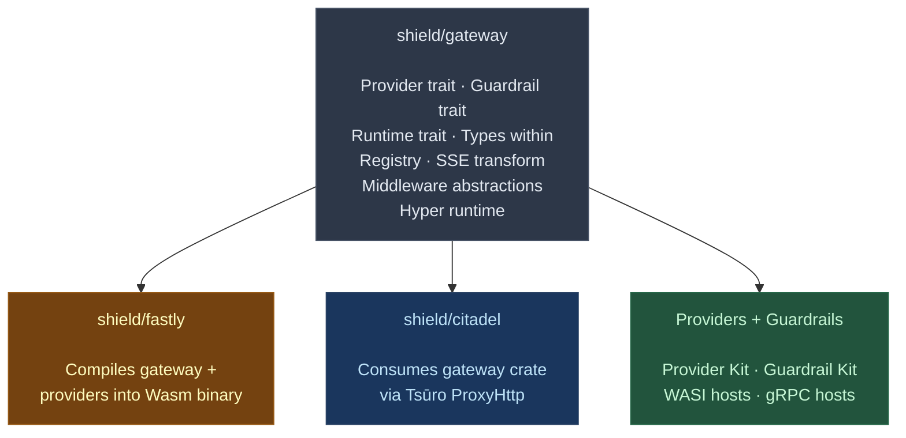
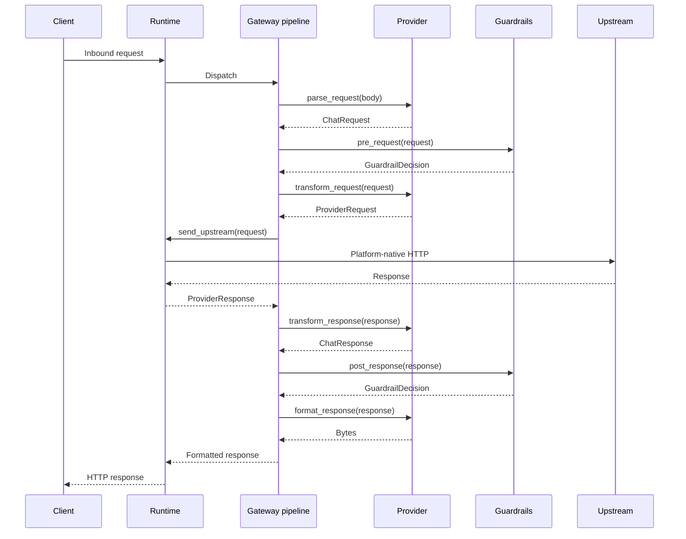

# Architecture decision record

## Overview

### Title

Multi-runtime gateway architecture

### Number

ADR-0001

### Status

- [x] Proposed (under review)
- [ ] Accepted (decision made and active)
- [ ] Deprecated (no longer recommended)
- [ ] Superseded (replaced by ADR-XXXX)

### Date

2026-02-10

### Decision makers

- @HelloFillip

### Affected projects

- [x] Core (protocol, gateway, control, standalone)
- [ ] Plugin system (plugin-host, plugin-grpc, plugin SDK)
- [ ] Provider plugins (OpenAI, Anthropic, Bedrock, Vertex, Ollama, etc.)
- [ ] Capability plugins (guardrails, cache, cost, ratelimit, auth, transform)
- [x] Deployment targets (Fastly, Cloudflare, AWS, Kong, Tsūro, containers)
- [ ] Managed service extensions (billing, SSO, onboarding)

---

## Context and problem statement

### Current situation

The Wúménguān prototype validated Shield's transformation-based gateway architecture on Fastly Compute. Every request flows through a standard format — analytics, guardrails, and observability all operate on this normalised representation, never on provider-specific formats. Moving to production requires deploying the same gateway logic across fundamentally different runtime environments:

- **Fastly Compute** (edge WebAssembly) — synchronous request handler, backend declarations for upstream connections, platform-managed TLS, compiled to `wasm32-wasi`
- **Hyper 1.x standalone** — async tower service, hyper-util connection pool, hyper-rustls TLS, native binary
- **Tsūro for Citadel** (managed service) — callback-based ProxyHttp trait, global connection pool, BoringSSL, master/worker process model with zero-downtime upgrades

These runtimes share nothing at the HTTP server level. Their body types are incompatible (Fastly Body, hyper Incoming, Tsūro Bytes chunks). Their connection management models are irreconcilable (per-request backend declarations, pooled async clients, global connection pools with fork-based worker processes). Their lifecycle models differ fundamentally (single request handler, long-lived async server, master/worker fork).

Yet the provider transformation logic — parsing requests, converting between formats, calculating cost, extracting usage from streaming responses — is identical regardless of runtime. This logic is pure computation with no I/O dependency.

### Decision drivers

- The gateway must deploy identically on edge (Fastly Compute), standalone (Hyper), and managed (Citadel/Tsūro) targets without duplicating provider or routing logic
- Each runtime has incompatible HTTP server abstractions — no shared HTTP server trait spans all three
- The Fastly build compiles to WebAssembly and cannot use async runtimes or dynamic plugin loading
- Citadel requires Tsūro's zero-downtime upgrades, global connection pooling, and process management capabilities
- Provider transformation logic (parsing, format conversion, cost calculation) is pure computation, independent of I/O
- The architecture must separate I/O concerns (upstream communication) from computation concerns (transformation, routing, guardrail inspection)
- New deployment targets (Cloudflare Workers, AWS Lambda, Kong) must be addable without modifying the gateway library

### Technical requirements

- Single gateway library crate containing all provider, guardrail, routing, and transformation logic
- A `Runtime` trait that abstracts upstream communication, implementable by each deployment target
- Hyper runtime as the default feature within the gateway crate, producing a standalone binary
- Separate projects for Fastly (`shield/fastly`) and Citadel (`shield/citadel`) consuming the gateway library
- No duplication of provider or guardrail logic across runtime targets
- Streaming server-sent event proxy support across all runtimes
- Types compatible with WebAssembly Interface Types for future WASI component boundaries

---

## Decision

### Chosen approach

Structure `shield/gateway` as a framework-agnostic library crate that owns all domain logic: provider transformation, guardrail pipeline, routing, and stream handling. Define a `Runtime` trait that each deployment target implements to handle upstream communication. The Hyper runtime lives within `shield/gateway` as a default feature gate, making the crate both a library and a standalone binary. `shield/fastly` and `shield/citadel` are separate projects that implement `Runtime` for their respective platforms.

The gateway request pipeline operates as ten discrete steps:

1. Receive inbound request (runtime-specific)
2. Route to provider via `ProviderRegistry`
3. Parse request to standard format (`Provider::parse_request`)
4. Run guardrail pre-request pipeline (`GuardrailPipeline::pre_request`)
5. Transform to provider format (`Provider::transform_request`)
6. Send upstream via `Runtime::send_upstream` or `Runtime::send_upstream_streaming`
7. Transform response to standard format (`Provider::transform_response`)
8. Run guardrail post-response pipeline (`GuardrailPipeline::post_response`)
9. Format response for client (`Provider::format_response`)
10. Return response (runtime-specific)

Steps 1 and 10 are runtime-specific. Steps 2–9 are gateway library logic shared across all runtimes.

### Technical rationale

Separating I/O (the `Runtime` trait) from computation (provider transformation, guardrail inspection, routing) means each runtime only implements the platform-specific parts. This eliminates provider logic duplication entirely.

The key abstraction — the `Runtime` trait:

```rust
/// Runtime-specific operations that the gateway delegates to the deployment target.
///
/// Each deployment target (Hyper standalone, Fastly Compute, Citadel/Tsūro)
/// implements this trait to handle upstream provider communication using
/// platform-native HTTP clients and connection management.
pub trait Runtime: Send + Sync + 'static {
    /// Send a request to an upstream provider and return the complete response.
    async fn send_upstream(
        &self,
        request: ProviderRequest,
    ) -> Result<ProviderResponse, GatewayError>;

    /// Send a streaming request and return a server-sent event frame stream.
    async fn send_upstream_streaming(
        &self,
        request: ProviderRequest,
    ) -> Result<Pin<Box<dyn Stream<Item = Result<Bytes, GatewayError>> + Send>>, GatewayError>;
}
```

The trait uses owned types (`ProviderRequest`, `ProviderResponse`, `Bytes`) rather than borrowed references, ensuring compatibility with WebAssembly Interface Types for future WASI component boundaries. The async trait methods accommodate both synchronous (Fastly) and asynchronous (Hyper, Tsūro) upstream communication — Fastly's implementation wraps synchronous backend API calls in async blocks that resolve immediately.

### Implementation approach

The gateway crate (`shield/gateway`) contains these domain modules:

- **`provider`** — `Provider` trait, `ChatRequest`, `ChatResponse`, `Message`, `Usage`, `StreamEvent`, `ProviderRequest`, `ProviderResponse`, `ProviderRegistry`, `ProviderError`. All types live within this module.
- **`guardrail`** — `Guardrail` trait, `GuardrailContext`, `GuardrailDecision`, `GuardrailPipeline`, `GuardrailError`. All types live within this module.
- **`stream`** — `StreamTransform` trait, server-sent event parsing utilities, frame boundary handling.
- **`routing`** — Path-based provider matching and request dispatch.
- **`runtime`** — `Runtime` trait definition, `GatewayError`, pipeline orchestration.
- **`middleware`** — Framework-agnostic middleware contracts (auth, rate limiting, analytics).
- **`hyper`** (feature-gated) — Hyper 1.x server, tower middleware composition, hyper-util connection pooling, hyper-rustls TLS, standalone binary entry point.



The gateway request pipeline:



The Fastly project (`shield/fastly`) implements `Runtime` using Fastly backend API for upstream requests, compiles all built-in providers and guardrails statically (no dynamic plugin loading), uses Fastly `StreamingBody` for server-sent event forwarding, and mirrors Wúménguān's request pipeline flow.

The Citadel project (`shield/citadel`) implements `Runtime` using Tsūro's upstream connection API, implements `ProxyHttp` trait callbacks delegating to gateway library for transformation logic, uses Tsūro's global connection pool, TLS management, and zero-downtime upgrade capabilities, and supports WASI and gRPC plugin loading for providers and guardrails.

---

## Alternatives considered

### Alternative 1: Monorepo with feature flags

**Description**: A single crate with `#[cfg(feature = "fastly")]`, `#[cfg(feature = "hyper")]`, `#[cfg(feature = "tsuro")]` gates controlling which runtime compiles.

**Advantages**: Single project, simpler dependency management, single CI pipeline.

**Disadvantages**: Fastly requires a separate build system (Fastly CLI) and its own `Cargo.toml` with `[package.metadata.fastly]`. Tsūro's process management model (master/worker with fork) is incompatible with Hyper's single-process tokio runtime. Mixing three runtimes in one crate creates confusing conditional compilation boundaries. WebAssembly target restrictions bleed into the entire crate.

**Rejection reason**: The fundamental incompatibility between build systems (Fastly CLI versus Cargo), process models (fork-based versus async runtime), and compilation targets (`wasm32-wasi` versus native) makes feature flags impractical for runtime selection.

### Alternative 2: Shared HTTP abstraction layer

**Description**: Create a runtime-agnostic HTTP server and client abstraction that all three platforms implement, similar to Java's servlet API.

**Advantages**: Complete abstraction of HTTP handling, uniform request/response types everywhere.

**Disadvantages**: The three runtimes differ at every level — body types (Fastly Body is not a `Stream`), connection lifecycle (Fastly: per-request backend; Hyper: pooled client; Tsūro: global pool with zero-downtime), TLS (Fastly: platform-managed; Hyper: rustls; Tsūro: BoringSSL), and server lifecycle (Fastly: single request; Hyper: long-lived server; Tsūro: master/worker fork). Abstracting this fully would produce a lowest-common-denominator interface losing each platform's strengths.

**Rejection reason**: The `Runtime` trait abstracts at exactly the right level — upstream communication — without trying to unify HTTP serving, which is irreducibly different across the three platforms.

---

## Impact analysis

### Technical impact

The crate structure cleanly separates concerns. Provider authors write against the gateway library's `Provider` trait without knowing which runtime will execute their code. Guardrail authors similarly write against the `Guardrail` trait. The gateway library is tested independently of any runtime. Each runtime project has a focused scope: implement `Runtime`, wire up HTTP serving, and configure the provider registry.

Adding a new deployment target (Cloudflare Workers, AWS Lambda, Kong) requires only implementing the `Runtime` trait — no changes to the gateway library. Provider and guardrail code is written once and works everywhere.

### Development workflow impact

Contributors working on providers or guardrails only need the gateway crate — they can test transformations without running any specific runtime. Runtime-specific work is isolated to `shield/fastly` or `shield/citadel`. The Hyper runtime in `shield/gateway` serves as the default development and testing environment.

Provider contribution workflow:
1. Implement the `Provider` trait in the gateway crate
2. Write unit tests using the kit's test harness
3. Run `cargo test --no-default-features` to verify library independence
4. Submit merge request — maintainers review transformation logic only

### Cross-project impact

This establishes the foundational crate structure for all Shield projects. The Provider Kit and Guardrail Kit (ADR-0002) build on the traits defined here. The streaming proxy strategy (ADR-0003) operates within the pipeline defined here. The control plane separation (ADR-0004) will define trait abstractions consumed by the middleware layer.

---

## Technical considerations

### Architecture implications

The `Runtime` trait is the only boundary between the gateway library and deployment targets. All other logic — providers, guardrails, routing, streaming — lives in the gateway library. This inverted dependency (the library defines the trait, runtimes implement it) ensures the gateway logic never depends on any specific runtime.

The ten-step pipeline is deterministic: parsing, transformation, and guardrail inspection are pure functions on their inputs. Only step 6 (send upstream) involves I/O, and that is delegated to the `Runtime` trait. This makes the pipeline trivially testable without any runtime infrastructure.

### Performance implications

The `Runtime` trait uses async methods, meaning upstream communication is non-blocking on Hyper and Tsūro. On Fastly, the async boundary compiles to a synchronous call since Fastly Compute does not provide an async runtime — this is acceptable because Fastly's backend API is inherently synchronous.

The trait uses `Bytes` for zero-copy where possible and owned values to avoid lifetime complexity across async boundaries. Provider transformation (the CPU-bound work) runs in-process on all runtimes, avoiding any serialisation overhead.

### Security implications

Each runtime handles TLS independently using its platform's capabilities:
- **Fastly**: Platform-managed TLS with automatic certificate validation
- **Hyper**: rustls with configurable certificate roots
- **Tsūro**: BoringSSL with platform-specific certificate management

The gateway library does not handle TLS directly. Shield key validation, authentication, and authorisation operate in the middleware layer, shared across runtimes. Guardrails inspect request and response content before forwarding, and the guardrail pipeline runs identically across all runtimes, ensuring consistent policy enforcement.

### Maintainability implications

Single source of truth: provider transformation logic exists in one place (the gateway library). Bug fixes automatically apply to all deployment targets. Runtime-specific bugs are isolated to their respective projects. The gateway library has minimal dependencies, reducing supply chain risk.

---

## Implementation plan

### Phase 1: Gateway library foundation

**Technical goal**: Establish the gateway crate with `Runtime` trait, domain modules, and Hyper runtime.

**Deliverables**: `shield/gateway` crate with provider, guardrail, stream, routing, runtime, and middleware modules. Hyper runtime behind a default feature gate. Standalone binary entry point. Comprehensive unit test suite. Module-level rustdoc documentation.

**Dependencies**: ADR-0001 acceptance, ADR-0002 provider and guardrail trait design.

### Phase 2: Fastly runtime

**Technical goal**: Validate runtime pluggability by building the Fastly Compute edge binary.

**Deliverables**: `shield/fastly` project implementing `Runtime` via Fastly backend API. Static compilation of built-in providers into WebAssembly binary. Server-sent event streaming via `StreamingBody`. Integration tests using Fastly's local testing tools.

**Dependencies**: Phase 1 gateway library, Fastly CLI build infrastructure.

### Phase 3: Citadel runtime

**Technical goal**: Deliver the managed Tsūro-based deployment with plugin support.

**Deliverables**: `shield/citadel` project implementing `Runtime` via Tsūro upstream connection API. `ProxyHttp` implementation delegating to gateway library. WASI and gRPC plugin host integration. Zero-downtime upgrade handling.

**Dependencies**: Phase 1 gateway library, Tsūro framework availability.

### Migration strategy

No migration is needed — this is a greenfield architecture. The Wúménguān prototype serves as a reference implementation, not a codebase to migrate. Provider transformation logic will be ported from Wúménguān's `ChatProvider` trait to the new `Provider` trait.

### Success metrics

- Gateway library compiles and passes all tests without any runtime feature enabled (pure library mode)
- Hyper runtime produces a working standalone binary that proxies requests to at least one provider
- Fastly project compiles to a valid WebAssembly binary from the same gateway library code
- Zero provider logic duplication across runtime projects — verified by code review
- Streaming server-sent event proxy works end-to-end on both Hyper and Fastly runtimes

---

## Risk assessment

### Technical risks

| Risk | Technical impact | Probability | Mitigation strategy |
|------|------------------|-------------|---------------------|
| Async trait overhead on Fastly synchronous runtime | Low | Low | Fastly's implementation wraps synchronous calls; the async boundary compiles away in the single-threaded Wasm target |
| Runtime trait too narrow for future deployment targets | Medium | Low | The trait methods are deliberately minimal; new targets can add platform-specific extensions via trait composition; methods can be added with default implementations |
| Tsūro's ProxyHttp callbacks conflict with gateway pipeline model | Medium | Medium | Citadel's implementation maps ProxyHttp callbacks to discrete pipeline steps; request body is buffered in callbacks before invoking the gateway pipeline |
| WebAssembly binary size exceeds Fastly limits | Low | Low | Use `wasm-opt` and link-time optimisation; support compiling a subset of providers via feature flags; monitor binary size in CI |

### Contingency planning

If the `Runtime` trait proves insufficient for a future deployment target, it can be extended with default-implemented methods without breaking existing implementations. If the Tsūro impedance mismatch is severe, Citadel can call gateway library functions directly from within ProxyHttp callbacks, bypassing the `Runtime` trait while preserving code reuse for transformation logic. If async overhead on Fastly is measurable, a separate `SyncRuntime` trait can be introduced for synchronous environments.

---

## Community collaboration

### Contributor impact

Developers contributing providers or guardrails work exclusively with the gateway crate and never interact with runtime-specific code. This substantially lowers the barrier to contribution — no need to understand Fastly, Hyper, or Tsūro internals. Runtime contributors need deep expertise in their specific platform but not in provider transformation logic. This separation enables parallel contribution streams without coordination overhead.

### Communication plan

This ADR will be published as a merge request in the architecture repository. Technical documentation for the gateway crate will include architecture diagrams showing the runtime boundary. Each runtime project will have a focused README explaining its role. Developer guides will cover provider development, guardrail development, and runtime implementation as separate tracks.

---

## Documentation and knowledge

### Documentation updates

- Architecture documentation describing the multi-runtime model and the Runtime trait contract
- Gateway crate module-level rustdoc for each domain module
- Sequence diagrams for non-streaming and streaming request flows
- Runtime project READMEs explaining platform-specific configuration and deployment
- Developer guides for provider, guardrail, and runtime contributors

### Knowledge transfer

The `Runtime` trait contract is simple enough to understand from its two methods. The three built-in runtime implementations (Hyper, Fastly, Tsūro) serve as reference implementations for new deployment targets. The Wúménguān prototype documentation explains the transformation-based architecture that this ADR formalises. The gateway library's comprehensive test suite serves as executable documentation.

---

## Monitoring and review

### Technical monitoring

- Build success rates for each runtime target across CI pipelines
- Unit test pass rates for the gateway library in library-only mode
- Binary size tracking for the Fastly WebAssembly target
- Request latency broken down by pipeline stages for each runtime in production
- Provider coverage: number of providers tested against each runtime

### Review criteria

This decision should be reviewed if a new deployment target cannot reasonably implement the `Runtime` trait, if profiling reveals measurable performance overhead from the trait abstraction (greater than 10% latency increase), or if the separation between library and runtime code becomes unclear.

### Review schedule

**Next review date**: 2026-08-10

---

## Related work

### Technical dependencies

This ADR establishes the foundational architecture for all Shield projects. No prior ADRs exist.

External dependencies:
- Wúménguān prototype: reference implementation demonstrating transformation-based architecture
- Tsūro framework: dependency for Citadel runtime implementation
- Fastly Compute platform: deployment target for edge runtime
- Hyper 1.x: HTTP server and client library for standalone runtime

### Relationships

- **Builds on**: Wúménguān prototype transformation-based architecture
- **Enables**: ADR-0002 (provider and guardrail plugin architecture), ADR-0003 (streaming proxy strategy), ADR-0004 (data plane and control plane separation)
- **Affects**: All Shield runtime projects (`shield/gateway`, `shield/fastly`, `shield/citadel`), all provider implementations, all guardrail implementations
- **Requires**: None (foundational decision)

---

## Governance

This decision follows the
[Omnifi Foundation governance model](https://handbook.omnifi.coop/engineering/architecture/governance/).
Technical leads carry responsibility for shepherding proposals through the
process. Architecture decision records use lazy consensus — see the
[handbook](https://handbook.omnifi.coop/engineering/architecture/adrs/) for
details.

---

## Labels and automation

/label ~"adr" ~"architecture" ~"technical"
