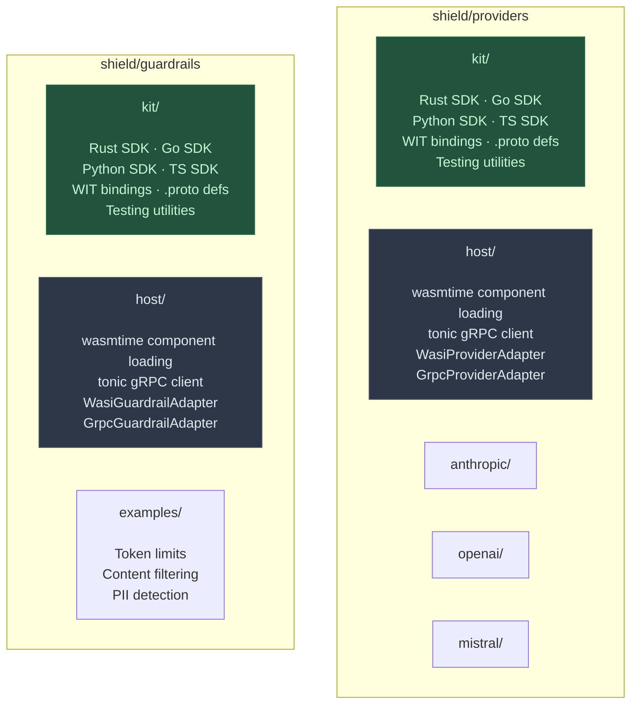
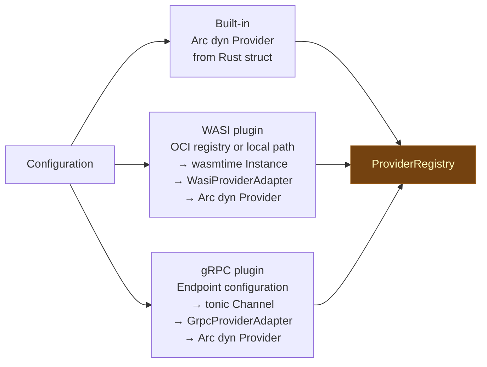
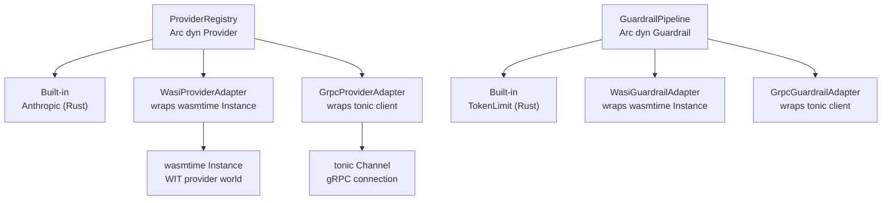

# Architecture decision record

## Overview

### Title

Provider and guardrail plugin architecture

### Number

ADR-0002

### Status

- [x] Proposed (under review)
- [ ] Accepted (decision made and active)
- [ ] Deprecated (no longer recommended)
- [ ] Superseded (replaced by ADR-XXXX)

### Date

2026-02-10

### Decision makers

- @HelloFillip

### Affected projects

- [x] Core (protocol, gateway, control, standalone)
- [x] Plugin system (plugin-host, plugin-grpc, plugin SDK)
- [x] Provider plugins (OpenAI, Anthropic, Bedrock, Vertex, Ollama, etc.)
- [x] Capability plugins (guardrails, cache, cost, ratelimit, auth, transform)
- [ ] Deployment targets (Fastly, Cloudflare, AWS, Kong, Tsūro, containers)
- [ ] Managed service extensions (billing, SSO, onboarding)

---

## Context and problem statement

### Current situation

Shield's gateway must integrate with multiple AI model providers (Anthropic, OpenAI, Mistral, and many more). The Wúménguān prototype defined a `ChatProvider` trait that each provider implements for bidirectional format transformation. Moving to production, Shield must support two distinct plugin dimensions:

1. **Providers** — AI model integrations that handle request/response transformation between Shield's standard format and provider-specific API formats (Anthropic Messages API, OpenAI Chat Completions, OpenAI Responses API, etc.)
2. **Guardrails** — Safety and policy enforcement plugins that inspect, modify, or block requests and responses based on configurable rules (token limits, content filtering, personally identifiable information detection, cost controls, etc.)

Both dimensions must support three implementation mechanisms:
- **Built-in** (compiled Rust) — for edge deployments like Fastly Compute where dynamic loading is impossible
- **WebAssembly System Interface (WASI) components** (preferred) — portable, sandboxed plugins loaded at runtime, authored in any language that compiles to WebAssembly
- **gRPC services** (optional) — for teams preferring language-agnostic service boundaries with existing infrastructure

The gateway code must not distinguish between built-in implementations, WASI components, and gRPC services.

Critically, plugin developers work in many languages — not just Rust. The Provider Kit and Guardrail Kit must ship language-specific SDKs so developers can author plugins in Rust, Go, Python, TypeScript, and other languages that compile to WASI components or implement gRPC services.

### Decision drivers

- Fastly Compute compiles to WebAssembly and cannot load WASI components at runtime — providers must be compilable as built-in Rust
- WASI components provide portable, sandboxed, language-agnostic plugins with fine-grained capability control
- Some organisations prefer gRPC for plugin integration, especially when plugins are implemented in languages other than Rust
- Provider authors and guardrail authors are different audiences solving different problems — they need separate SDKs
- Plugin developers work in diverse languages — kits must provide language-specific SDKs for each supported language
- The gateway must process guardrails in a defined order: pre-request guardrails before sending upstream, post-response guardrails before returning to the client, and stream event guardrails during streaming
- Types must live within their respective domain modules, not in a separate types crate
- Plugin distribution must work with any OCI-compatible registry, not just GitLab

### Technical requirements

- `Provider` trait and `Guardrail` trait defined in the gateway crate
- All types (`ChatRequest`, `ChatResponse`, `GuardrailDecision`, etc.) live alongside their respective traits
- Provider Kit — multi-language SDKs for provider plugin authors (Rust, Go, Python, TypeScript, and more)
- Guardrail Kit — multi-language SDKs for guardrail plugin authors (same language coverage)
- Provider host (`shield/providers/host`) — loads WASI components and gRPC services, adapts to `Provider` trait
- Guardrail host (`shield/guardrails/host`) — loads WASI components and gRPC services, adapts to `Guardrail` trait
- `WasiProviderAdapter` and `WasiGuardrailAdapter` wrapping wasmtime component instances
- `GrpcProviderAdapter` and `GrpcGuardrailAdapter` wrapping tonic gRPC clients
- `ProviderRegistry` holding `Arc<dyn Provider>`
- `GuardrailPipeline` holding ordered `Vec<Arc<dyn Guardrail>>`
- WebAssembly Interface Types (WIT) world definitions as the canonical contract for both WASI and as the source for gRPC `.proto` generation
- Registration model: built-in + WASI + gRPC on Hyper/Citadel; built-in only on Fastly

---

## Decision

### Chosen approach

Define a `Provider` trait and a `Guardrail` trait within the gateway crate's respective domain modules. Both built-in Rust implementations and adapter wrappers (WASI via wasmtime, gRPC via tonic) implement these traits. The Provider Kit and Guardrail Kit each ship multi-language SDKs — one per supported language — so that plugin developers author plugins in their language of choice. Each kit's host package loads WASI components and optionally connects to gRPC services.

The WIT world definitions are the canonical contract. Language-specific SDKs generate bindings from the WIT worlds (for WASI plugins) or from derived `.proto` definitions (for gRPC plugins). The Rust trait in the gateway crate is derived from the same WIT contract, ensuring a single source of truth.

### Technical rationale

**Separate traits for separate audiences**: Provider authors need to understand AI model API formats — request parsing, format conversion, streaming dialects, cost calculation. Guardrail authors need to understand safety policies, content classification, and decision logic. Mixing these concerns would create a confusing SDK. Separate traits and kits serve each audience distinctly.

**Multi-language kits**: WASI components can be authored in any language that compiles to WebAssembly — Rust, Go (via TinyGo), Python (via componentize-py), JavaScript/TypeScript (via ComponentizeJS), C/C++ (via wasi-sdk), and others. gRPC services can be implemented in any language with a gRPC library. Providing language-specific SDKs with idiomatic bindings, code generation, and testing utilities dramatically lowers the barrier for plugin developers. A Python developer should not need to learn Rust to write a guardrail.

**Adapter pattern**: `WasiProviderAdapter`, `GrpcProviderAdapter`, `WasiGuardrailAdapter`, and `GrpcGuardrailAdapter` ensure the gateway code interacts solely via trait objects — the implementation mechanism is invisible. The gateway never knows whether a provider is built-in Rust, a WASI component written in Go, or a gRPC service written in Python.

**Owned types for portability**: All trait method return types use owned values (`String`, `Bytes`, `Box<dyn ...>`) rather than borrowed references. This ensures compatibility with WIT for WASI plugins and with Protocol Buffers serialisation for gRPC plugins.

### Implementation approach

**The Provider trait** (within `gateway::provider`):

```rust
pub trait Provider: Send + Sync {
    /// Provider identifier (e.g., "anthropic", "openai").
    fn name(&self) -> &str;

    /// Check if this provider handles the given request path and body.
    fn matches_request(&self, path: &str, body: &[u8]) -> bool;

    /// Base URL for the upstream provider API.
    fn base_url(&self) -> &str;

    /// Parse client request body to standard format.
    fn parse_request(&self, body: &Bytes) -> Result<ChatRequest, ProviderError>;

    /// Transform standard request to provider-specific format.
    fn transform_request(
        &self,
        request: &ChatRequest,
        auth_token: &str,
        client_headers: &HeaderMap,
        raw_body: &Bytes,
    ) -> Result<ProviderRequest, ProviderError>;

    /// Transform provider response to standard format.
    fn transform_response(
        &self,
        response: ProviderResponse,
    ) -> Result<ChatResponse, ProviderError>;

    /// Format standard response for the client.
    fn format_response(&self, response: &ChatResponse) -> Result<Bytes, ProviderError>;

    /// Calculate cost from usage metrics.
    fn calculate_cost(&self, model: &str, usage: &Usage) -> f64;

    /// Return the stream transform for this provider's server-sent event dialect.
    fn stream_transform(&self) -> Box<dyn StreamTransform>;
}
```

**The Guardrail trait** (within `gateway::guardrail`):

```rust
pub trait Guardrail: Send + Sync {
    /// Guardrail identifier (e.g., "token-limit", "content-filter").
    fn name(&self) -> &str;

    /// Inspect and optionally modify a request before it reaches the provider.
    fn pre_request(
        &self,
        request: &ChatRequest,
        context: &GuardrailContext,
    ) -> Result<GuardrailDecision, GuardrailError>;

    /// Inspect and optionally modify a response before it reaches the client.
    fn post_response(
        &self,
        response: &ChatResponse,
        context: &GuardrailContext,
    ) -> Result<GuardrailDecision, GuardrailError>;

    /// Inspect a streaming event in-flight.
    fn stream_event(
        &self,
        event: &StreamEvent,
        context: &GuardrailContext,
    ) -> Result<GuardrailDecision, GuardrailError>;
}
```

Both traits are synchronous — transformation and inspection are pure computation, not I/O. The `Runtime` trait (ADR-0001) handles upstream I/O.

**Package structure**:



**Plugin loading flow**:



**Plugin adaptation model**:



**Multi-language SDK structure** (per kit):

Each kit ships language-specific SDKs generated from the WIT world definitions:

| Language | WASI compilation | gRPC support | SDK tooling |
|----------|-----------------|--------------|-------------|
| Rust | Native `cargo component` | tonic codegen from `.proto` | `wit-bindgen`, derive macros |
| Go | TinyGo to `wasm32-wasi` | standard `protoc-gen-go-grpc` | `wit-bindgen-go` |
| Python | componentize-py | grpcio from `.proto` | `componentize-py`, typed stubs |
| TypeScript | ComponentizeJS | `@grpc/grpc-js` from `.proto` | `jco`, typed interfaces |
| C/C++ | wasi-sdk | standard gRPC C++ | `wit-bindgen-c` |

The WIT world is the single source of truth. Language SDKs are generated artefacts, not hand-maintained code. When the WIT world evolves (via RFC-0001), all language SDKs regenerate automatically.

**Registration model**:
- **Hyper standalone**: built-in providers at startup + WASI plugins from configured directories or OCI registries + gRPC service connections from configuration
- **Fastly**: built-in only, registered at startup via feature flags (same as Wúménguān prototype). No WASI host, no gRPC.
- **Citadel**: built-in + WASI + gRPC, same capabilities as Hyper standalone

---

## Alternatives considered

### Alternative 1: Single plugin trait for both providers and guardrails

**Description**: A unified `Plugin` trait with methods for both transformation and inspection, where each plugin declares its capabilities.

**Advantages**: Single SDK, single host, simpler architecture.

**Disadvantages**: Provider authors must stub guardrail methods and vice versa. The trait becomes large and unfocused. The two audiences (AI model integration developers versus safety/policy developers) need different documentation, examples, and language SDK tooling. Capability declaration adds complexity.

**Rejection reason**: The responsibilities are fundamentally different. Providers transform between formats (bidirectional, stateless). Guardrails inspect and decide (unidirectional, potentially stateful across a request lifecycle). Separate traits and kits serve each audience better.

### Alternative 2: gRPC only for external plugins (no WASI)

**Description**: Use gRPC as the sole external plugin mechanism, skip WASI component support.

**Advantages**: Simpler host implementation. gRPC is well-understood. Multi-language support inherent via Protocol Buffers codegen.

**Disadvantages**: gRPC requires a network hop even for co-located plugins, adding latency. WASI components run in-process with microsecond-level call overhead. gRPC requires managing connections, retries, and service discovery. WASI components provide fine-grained sandboxing at the WebAssembly level.

**Rejection reason**: WASI components provide superior performance (no network hop), portable sandboxing, and deterministic execution. gRPC is offered as an optional alternative for teams with existing gRPC infrastructure, not as the primary mechanism.

### Alternative 3: Types in a shared crate

**Description**: Create a `shield-types` crate containing all shared types used by providers and guardrails.

**Advantages**: Single source of truth for types. Clear dependency direction.

**Disadvantages**: Creates an artificial separation between types and the traits that use them. Every type change requires coordinating two crates. The types are meaningless without their traits — they are part of the provider and guardrail domains, not standalone constructs.

**Rejection reason**: Types belong within their domain modules. `ChatRequest` is part of the provider domain. `GuardrailDecision` is part of the guardrail domain. Extracting them creates coupling without benefit.

---

## Impact analysis

### Technical impact

The dual trait design establishes two independent extension points for Shield. Provider plugins grow the set of AI model services Shield can integrate with. Guardrail plugins grow the set of safety and policy controls available. Both extension points support three implementation mechanisms (built-in, WASI, gRPC) through the adapter pattern. The gateway crate's pipeline (ADR-0001) orchestrates providers and guardrails through trait objects, unaware of implementation mechanism or authoring language.

The multi-language kit approach means the plugin ecosystem is not limited to Rust developers. A Python team can author a guardrail for personally identifiable information detection using their existing Python libraries, compile it to a WASI component, and deploy it alongside built-in Rust providers with zero gateway changes.

### Development workflow impact

Provider developers choose their language, install the corresponding SDK from the Provider Kit, implement the provider interface, and compile to either a WASI component or a gRPC service. They can test in isolation using the kit's testing utilities. Guardrail developers follow the same pattern with the Guardrail Kit. Neither audience needs to understand wasmtime, tonic, or gateway internals.

### Cross-project impact

The WIT world definitions must be stable public interfaces — RFC-0001 will formalise this. The `.proto` definitions are derived from the WIT worlds, ensuring consistency. The trait designs influence the shared MCP infrastructure at `rai.onl/mcp` which defines WIT worlds for WASI components across the Rai ecosystem.

---

## Technical considerations

### Architecture implications

The adapter pattern (`WasiProviderAdapter` wrapping wasmtime, `GrpcProviderAdapter` wrapping tonic) cleanly isolates the loading mechanism from the gateway pipeline. New plugin mechanisms (for example, dynamic Rust libraries via `dlopen`) could be added as additional adapters without changing the gateway code. The WIT-first contract design means the Rust trait, language SDKs, and gRPC definitions all derive from the same source, preventing drift.

### Performance implications

Built-in providers have zero overhead — they are direct trait method calls. WASI providers incur wasmtime function call overhead (microsecond-level per call). gRPC providers incur network hop latency (milliseconds for co-located, more for remote). Provider transformation (parsing, format conversion) is CPU-bound and benefits from running in-process. The provider host should pre-instantiate WASI modules at startup and reuse instances across requests. Ahead-of-time compilation of WASI components eliminates JIT overhead.

### Security implications

WASI components execute in a sandbox with explicit capability grants. A provider plugin cannot access the filesystem, network, or environment unless specifically granted through WASI capabilities. gRPC plugins run as separate services with their own process isolation. Built-in providers run in the gateway process with full access — they must be trusted code. All plugin mechanisms enforce the same functional contract (the WIT world), so a malicious plugin cannot return unexpected types.

### Maintainability implications

Separate kits mean separate versioning and release cycles. A Provider Kit update does not require a Guardrail Kit release. Language SDKs are generated from WIT worlds, so they stay in sync automatically. The WIT world definitions (published via RFC-0001) serve as the stable interface contract that all implementations — regardless of language or mechanism — must satisfy.

---

## Implementation plan

### Phase 1: Gateway traits and types

**Technical goal**: Define Provider and Guardrail traits with their domain types in the gateway crate.

**Deliverables**: `gateway::provider` module (trait, types, registry, error types), `gateway::guardrail` module (trait, types, pipeline, decision types, error types).

**Dependencies**: ADR-0001 (gateway crate structure).

### Phase 2: Built-in providers

**Technical goal**: Port provider implementations from the Wúménguān prototype.

**Deliverables**: Anthropic provider (Messages API with passthrough mode), OpenAI provider (Chat Completions API and Responses API), Mistral provider. All compile to both native and `wasm32-wasi` targets.

**Dependencies**: Phase 1 traits and types.

### Phase 3: WIT worlds and language SDKs

**Technical goal**: Define the canonical WIT contract and generate multi-language SDKs.

**Deliverables**: `rai:shield/provider` and `rai:shield/guardrail` WIT world definitions. Rust SDK with `wit-bindgen` and derive macros. Go SDK with `wit-bindgen-go`. Python SDK with `componentize-py`. TypeScript SDK with `jco`. Derived `.proto` service definitions for gRPC. Testing utilities per language.

**Dependencies**: Phase 1 traits (used as the reference for WIT world design).

### Phase 4: Plugin hosts

**Technical goal**: Implement WASI component loading and gRPC client adapters.

**Deliverables**: `shield/providers/host` (`WasiProviderAdapter`, `GrpcProviderAdapter`), `shield/guardrails/host` (`WasiGuardrailAdapter`, `GrpcGuardrailAdapter`). OCI registry integration for WASI component distribution.

**Dependencies**: Phase 3 WIT worlds and SDKs, wasmtime 29+, tonic 0.12+.

### Migration strategy

No migration needed — greenfield architecture. The Wúménguān `ChatProvider` trait serves as the reference for the new `Provider` trait. Key differences from the prototype: the new trait uses `&str` instead of `&'static str` for name/base_url (WIT compatibility), `Bytes` instead of `&[u8]`/`Vec<u8>` for body handling (zero-copy), and `HeaderMap` instead of `&[(String, String)]` for headers.

### Success metrics

- A WASI-compiled provider plugin loaded at runtime produces identical transformation results to the same provider compiled as built-in
- A gRPC provider adapter produces identical results to the equivalent WASI provider
- A provider authored in Go (via TinyGo WASI) passes the same conformance tests as the equivalent Rust provider
- Guardrail pipeline correctly applies pre-request and post-response guardrails in configured order
- Language SDKs generate valid bindings from the WIT world definitions without manual intervention
- Built-in providers compile to both native and `wasm32-wasi` targets without conditional compilation

---

## Risk assessment

### Technical risks

| Risk | Technical impact | Probability | Mitigation strategy |
|------|------------------|-------------|---------------------|
| WIT type mapping limitations for complex Rust types | Medium | Medium | Design trait return types with WIT compatibility in mind from the start — use owned values, avoid generics, avoid trait objects in signatures |
| Language SDK tooling immaturity for some languages | Medium | Medium | Start with Rust and Go SDKs (most mature WASI toolchains), add Python and TypeScript as their toolchains stabilise; gRPC provides an immediate fallback for any language |
| gRPC serialisation overhead for streaming events | Low | Medium | gRPC streaming (bidirectional) can forward events without per-event serialisation overhead; benchmark and compare with WASI path |
| WASI component instantiation latency | Medium | Low | Pre-instantiate at startup and pool instances; wasmtime's component model supports pre-compilation (ahead-of-time) to eliminate JIT overhead |
| WIT world and .proto definitions diverge | Medium | Low | Generate `.proto` from WIT world automatically; never hand-maintain `.proto` files; CI validates consistency |

### Contingency planning

If WASI component model maturity proves insufficient for a specific language, gRPC provides an immediate alternative — the plugin author implements a gRPC service in their preferred language. If gRPC latency is unacceptable for guardrails in the hot path, guardrails can be restricted to built-in or WASI only. The adapter pattern means the gateway code does not need to change — only the host configuration and registration.

---

## Community collaboration

### Contributor impact

Provider developers choose their language, install the corresponding SDK, and implement the provider interface. They do not need to understand Rust, wasmtime, or gRPC internals. The kit handles compilation to WASI components or gRPC stub generation. Guardrail developers follow the same pattern. Example plugins in each supported language serve as starting points.

### Communication plan

The Provider Kit and Guardrail Kit will each have language-specific quick-start guides, example plugins, and API references. The WIT world specifications will be published as RFC-0001 for community review with a minimum 14-day discussion period. Language SDK releases will follow the kit versioning, with clear compatibility matrices.

---

## Documentation and knowledge

### Documentation updates

- Provider Kit getting started guide — one per supported language
- Guardrail Kit getting started guide — one per supported language
- WIT world reference documentation
- Plugin distribution guide (building, publishing to OCI registries, loading)
- Gateway configuration guide for registering providers and guardrails (built-in, WASI paths, gRPC endpoints)
- Language SDK API reference generated from WIT worlds

### Knowledge transfer

Example providers (Anthropic, OpenAI, Mistral) serve as reference implementations for the Provider Kit. Example guardrails (token limits, content filtering, personally identifiable information detection) serve as reference implementations for the Guardrail Kit. Each example will be available in at least Rust and Go to demonstrate the multi-language SDK experience.

---

## Monitoring and review

### Technical monitoring

Plugin load times (WASI instantiation, gRPC connection establishment). Plugin call latency breakdown (built-in versus WASI versus gRPC). Error rates per plugin. Guardrail decision distribution (allow, modify, block). Language SDK adoption metrics (which languages are people using for plugins).

### Review criteria

Review this decision if the WASI component model specification changes significantly, if gRPC proves impractical for the guardrail hot path, if a third plugin mechanism (dynamic libraries, embedded scripting) is needed, or if a language's WASI toolchain proves too immature for production use.

### Review schedule

**Next review date**: 2026-08-10

---

## Related work

### Technical dependencies

ADR-0001 (multi-runtime gateway architecture) for the gateway crate structure and Runtime trait.

### Relationships

- **Builds on**: ADR-0001 (gateway crate structure), Wúménguān ChatProvider trait
- **Enables**: RFC-0001 (provider and guardrail interface specification), third-party multi-language plugin ecosystem
- **Affects**: Shield provider and guardrail projects, shared MCP infrastructure at `rai.onl/mcp`, language SDK toolchains
- **Requires**: ADR-0001 (gateway crate must exist)

---

## Governance

This decision follows the
[Omnifi Foundation governance model](https://handbook.omnifi.coop/engineering/architecture/governance/).
Technical leads carry responsibility for shepherding proposals through the
process. Architecture decision records use lazy consensus — see the
[handbook](https://handbook.omnifi.coop/engineering/architecture/adrs/) for
details.

---

## Labels and automation

/label ~"adr" ~"architecture" ~"technical"
