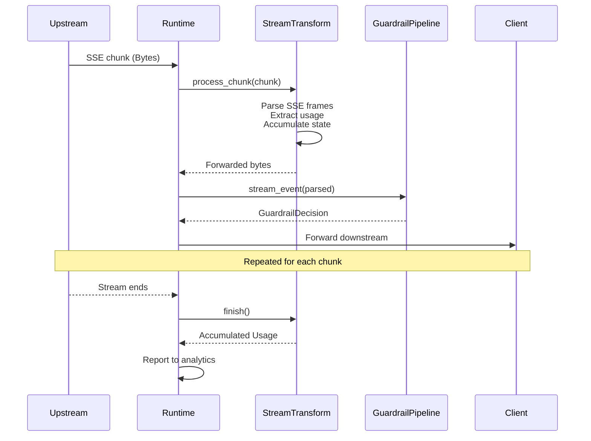
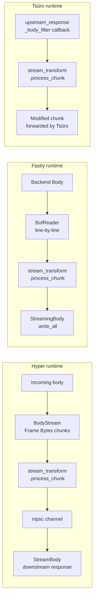

# Architecture decision record

## Overview

### Title

Streaming proxy strategy

### Number

ADR-0003

### Status

- [x] Proposed (under review)
- [ ] Accepted (decision made and active)
- [ ] Deprecated (no longer recommended)
- [ ] Superseded (replaced by ADR-XXXX)

### Date

2026-02-10

### Decision makers

- @HelloFillip

### Affected projects

- [x] Core (protocol, gateway, control, standalone)
- [ ] Plugin system (plugin-host, plugin-grpc, plugin SDK)
- [x] Provider plugins (OpenAI, Anthropic, Bedrock, Vertex, Ollama, etc.)
- [ ] Capability plugins (guardrails, cache, cost, ratelimit, auth, transform)
- [x] Deployment targets (Fastly, Cloudflare, AWS, Kong, Tsūro, containers)
- [ ] Managed service extensions (billing, SSO, onboarding)

---

## Context and problem statement

### Current situation

AI model providers use server-sent events (SSE) for streaming responses, but each provider uses a different SSE dialect:

- **OpenAI Chat Completions API**: Events are `data: {json}\n\n` lines. Stream terminates with `data: [DONE]\n\n`. Usage information appears in the final chunk before `[DONE]` (when `stream_options.include_usage` is set). Delta content arrives in `choices[0].delta.content`.
- **OpenAI Responses API**: Uses typed events like `event: response.output_item.added`, `event: response.completed`. Usage appears in the `response.completed` event. Structure differs significantly from Chat Completions.
- **Anthropic Messages API**: Uses named event types: `event: message_start` (contains input token count), `event: content_block_delta` (contains text deltas), `event: message_delta` (contains output token count and stop reason), `event: message_stop` (stream termination). Two-line format with `event:` and `data:` lines.
- **Mistral**: Similar to OpenAI Chat Completions with minor differences in the JSON structure.

The gateway must forward SSE frames in real-time (low latency, no buffering) while simultaneously extracting usage information (token counts, cost data) from the stream for analytics. This must work across all three runtimes (Hyper, Fastly Compute, Tsūro) without duplicating the dialect-specific parsing logic.

The Wúménguān prototype implemented SSE parsing directly in the Fastly request handler using a `BufReader` over the backend response body, reading line-by-line and forwarding via `StreamingBody`. This approach works but is tightly coupled to Fastly's I/O model.

### Decision drivers

- Each provider's SSE dialect requires different parsing logic to extract usage information
- SSE frames must be forwarded with minimal latency — no buffering the complete stream
- Usage extraction must happen during streaming, not after, to support real-time analytics
- The dialect-specific parsing logic must be shared across all runtimes (Hyper, Fastly, Tsūro)
- Guardrails must be able to inspect streaming events in-flight (ADR-0002)
- The three runtimes have fundamentally different body reading mechanisms:
  - Hyper: async `BodyStream` yielding `Frame<Bytes>` chunks
  - Fastly: synchronous `BufReader` over backend `Body`
  - Tsūro: `upstream_response_body_filter` callback receiving `Bytes` chunks
- Stream parsing must handle partial SSE frames that span chunk boundaries

### Technical requirements

- `StreamTransform` trait that each provider implements for its SSE dialect
- Runtime-agnostic operation — the trait works on `&Bytes` slices, not on specific body types
- Stateful parsing to handle SSE frames split across chunk boundaries
- Usage accumulation across the stream lifetime, reported when the stream completes
- Guardrail integration point for in-flight stream event inspection
- Zero-copy forwarding where possible — inspect bytes without reallocating
- Bounded buffer growth to prevent memory exhaustion from malformed streams

---

## Decision

### Chosen approach

Define a `StreamTransform` trait that each provider implements for its specific SSE dialect. The trait operates on byte slices, making it runtime-agnostic. Each runtime reads upstream chunks using its platform-native mechanism and passes them through the stream transform for inspection before forwarding downstream. The stream transform maintains state across chunks (for partial frame handling and usage accumulation) and reports accumulated usage when the stream completes.

A shared SSE frame parser in the gateway crate handles the wire format (splitting byte streams at `\n\n` boundaries, extracting `event:` and `data:` fields, handling partial frames). Provider-specific `StreamTransform` implementations add dialect-specific JSON parsing for usage extraction on top of the shared parser.

### Technical rationale

The `StreamTransform` trait abstracts at the byte level — it receives chunks and returns chunks. This is the only abstraction that works across all three runtimes because it makes no assumptions about body types, async versus sync, or streaming mechanisms. The trait is stateful (`&mut self`) because SSE parsing inherently requires buffering partial frames and accumulating usage across events.

The trait returns `Bytes` (not `&Bytes`) because the output may differ from the input when guardrails modify content or when partial frame buffering requires reassembly. In the common case of transparent proxying without modification, implementations return a clone of the input `Bytes` (reference-counted and cheap to clone).

### Implementation approach

**The StreamTransform trait** (within `gateway::stream`):

```rust
/// Transforms and inspects server-sent event streams for a specific provider dialect.
///
/// Each provider implements this trait to handle its SSE format. The runtime
/// feeds upstream chunks through `process_chunk` and forwards the returned
/// bytes downstream. When the stream ends, `finish` returns accumulated usage.
pub trait StreamTransform: Send {
    /// Process a chunk of upstream SSE data.
    ///
    /// Inspects the chunk for usage information and stream events,
    /// accumulating state internally. Returns the bytes to forward
    /// downstream (typically the input unchanged for transparent proxying).
    fn process_chunk(&mut self, chunk: &Bytes) -> Result<Bytes, StreamError>;

    /// Signal that the upstream stream has ended.
    ///
    /// Returns accumulated usage from the entire stream, or None if
    /// usage information was not available in the stream.
    fn finish(&mut self) -> Option<Usage>;

    /// Check if the stream has reached its terminal event.
    ///
    /// Returns true when the provider-specific termination signal has been
    /// received (e.g., `data: [DONE]` for OpenAI, `event: message_stop`
    /// for Anthropic).
    fn is_complete(&self) -> bool;
}
```

**How each runtime uses StreamTransform**:



**Runtime-specific plumbing**:



**Shared SSE parser**: The `gateway::stream::sse` module contains:
- `SseParser` — stateful parser that handles frame splitting at `\n\n` boundaries, field extraction (`event:`, `data:`, `id:`, `retry:`), and partial frame buffering across chunk boundaries
- `SseFrame` — parsed SSE frame with event type and data fields
- `StreamError` — error type for stream processing failures
- SIMD-accelerated boundary detection via `memchr`

**Provider-specific implementations**:
- `AnthropicStreamTransform` — handles `message_start` (input usage), `content_block_delta` (text), `message_delta` (output usage), `message_stop` (termination)
- `OpenAiChatStreamTransform` — handles `data: {json}` with delta content and `data: [DONE]` termination
- `OpenAiResponsesStreamTransform` — handles typed events (`response.output_item.added`, `response.completed`)
- `MistralStreamTransform` — handles Mistral's Chat Completions-compatible format

Each implementation uses the shared `SseParser` for wire format and adds dialect-specific JSON parsing on recognised events.

**Internal state model** (example for Anthropic):

```rust
struct AnthropicStreamTransform {
    /// Shared SSE frame parser handling chunk boundaries.
    parser: SseParser,
    /// Accumulated input token count from message_start event.
    input_tokens: u64,
    /// Accumulated output token count from message_delta events.
    output_tokens: u64,
    /// Model identifier extracted from message_start.
    model: Option<String>,
    /// Whether message_stop has been received.
    complete: bool,
}
```

---

## Alternatives considered

### Alternative 1: Parse and reformat all streams to a unified SSE format

**Description**: Parse each provider's SSE dialect completely, convert to a single normalised SSE format, and send the normalised format downstream. Clients always receive the same SSE schema regardless of provider.

**Advantages**: Clients see a consistent streaming format. Easier to build generic stream consumers. Usage extraction is a natural part of the parse step.

**Disadvantages**: Introduces latency — each chunk must be fully parsed and reformatted before forwarding. Breaks passthrough mode where clients expect the provider's native format. Loses provider-specific events that clients may rely on (for example, Anthropic's `content_block_start` with content type). Double serialisation (parse JSON, rebuild JSON) for every chunk.

**Rejection reason**: Shield's transformation model supports passthrough mode where the client receives the provider's native format. Normalising the stream format would break this and add measurable latency to every streaming response.

### Alternative 2: Runtime-specific stream handling with no shared trait

**Description**: Each runtime implements its own stream handling logic, calling into provider-specific utilities as needed.

**Advantages**: Each runtime can optimise for its platform's I/O model. No abstraction overhead.

**Disadvantages**: Dialect-specific parsing logic (extracting usage from Anthropic's `message_delta`, detecting OpenAI's `[DONE]` sentinel) must be duplicated across all three runtimes. Bug fixes must be applied three times. New providers require changes to all runtimes.

**Rejection reason**: This is exactly what the Wúménguān prototype does (Fastly-only), and scaling it to three runtimes would create an unsustainable maintenance burden. The dialect parsing logic is identical regardless of runtime — it should be written once.

### Alternative 3: Buffer the entire stream, then process

**Description**: Collect all SSE frames, extract usage information, then return the complete response.

**Advantages**: Simpler implementation. No partial frame handling needed. Usage is available before the response starts.

**Disadvantages**: Completely defeats the purpose of streaming. First-token latency becomes total-response latency. Memory usage scales with response size. Unusable for long-running streaming responses (code generation, extended reasoning).

**Rejection reason**: Streaming exists specifically for low first-token latency. Buffering eliminates this benefit entirely.

---

## Impact analysis

### Technical impact

Every provider plugin that supports streaming must implement `StreamTransform`. The shared SSE parser simplifies this — providers only need to handle their dialect-specific JSON parsing on top of the common wire format parser. The gateway pipeline (ADR-0001) invokes `StreamTransform` within the streaming path, and the `GuardrailPipeline` (ADR-0002) can inspect events via the parsed SSE frames. The `Provider::stream_transform()` method (ADR-0002) returns the appropriate `StreamTransform` implementation for each provider.

### Development workflow impact

Provider developers implement `StreamTransform` alongside their `Provider` trait implementation. The Provider Kit (ADR-0002) includes testing utilities for validating stream transforms with recorded SSE sessions from real providers. Each language SDK provides a stream transform interface matching the `StreamTransform` trait.

### Cross-project impact

The streaming strategy affects how analytics data flows. Usage information arrives asynchronously (when the stream ends) rather than synchronously (in the response). The analytics pipeline must accommodate this async delivery model.

---

## Technical considerations

### Architecture implications

The `StreamTransform` trait is the streaming counterpart to the `Provider` trait's synchronous transformation methods. Together they form the complete transformation pipeline: `Provider` for request/response transformation, `StreamTransform` for streaming response inspection. Each provider returns its `StreamTransform` via `Provider::stream_transform()`, maintaining the one-provider-one-implementation pattern.

### Performance implications

The byte-level abstraction adds minimal overhead — `process_chunk` receives the upstream bytes and typically returns them unchanged (transparent proxy). The SSE parser scans for `\n\n` boundaries using `memchr` for SIMD-accelerated byte scanning. JSON parsing for usage extraction happens only on specific events (not every chunk). `Bytes` cloning is cheap (reference-counted) for the transparent proxy case.

### Security implications

Stream transforms operate on untrusted data from upstream providers. The SSE parser must handle malformed input gracefully — truncated JSON, unexpected event types, missing fields. Buffer growth must be bounded to prevent memory exhaustion from malicious or malformed streams. The partial frame buffer is capped at a configurable maximum (default 1 MiB). If exceeded, the buffer is flushed as-is and a warning is logged.

### Maintainability implications

Adding a new provider requires implementing `StreamTransform` for its dialect. The shared SSE parser handles the wire format, so the provider implementation focuses solely on dialect-specific JSON parsing. The trait's three methods (`process_chunk`, `finish`, `is_complete`) are straightforward to implement and test. A typical implementation is 100–200 lines of Rust; language SDK implementations follow the same pattern.

---

## Implementation plan

### Phase 1: Shared SSE parser

**Technical goal**: Implement the SSE wire format parser that handles frame splitting, partial frames, and field extraction.

**Deliverables**: `gateway::stream::sse` module with `SseParser`, `SseFrame`, and SIMD-accelerated boundary detection. Comprehensive test suite with edge cases (partial frames, empty events, comments, multi-line data fields, frames split at every possible byte position).

**Dependencies**: None (standalone utility).

### Phase 2: StreamTransform trait and provider implementations

**Technical goal**: Define the trait and implement it for the initial providers.

**Deliverables**: `StreamTransform` trait definition. `AnthropicStreamTransform`, `OpenAiChatStreamTransform`, `OpenAiResponsesStreamTransform`, `MistralStreamTransform`. Test suite using recorded SSE sessions from real providers.

**Dependencies**: Phase 1 SSE parser, ADR-0002 provider trait (for `Provider::stream_transform()` method).

### Phase 3: Runtime integration

**Technical goal**: Wire StreamTransform into each runtime's streaming path.

**Deliverables**: Hyper streaming handler using `BodyStream` + `StreamTransform` + `StreamBody`. Fastly streaming handler using `BufReader` + `StreamTransform` + `StreamingBody`. Guardrail pipeline integration for in-flight event inspection.

**Dependencies**: Phase 2 stream transforms, ADR-0001 runtime implementations.

### Migration strategy

No migration needed — greenfield implementation. The Wúménguān prototype's line-by-line SSE parsing in the Fastly handler serves as the reference for the Anthropic stream transform implementation. The key improvement is extracting this logic from the Fastly-specific handler into a runtime-agnostic trait.

### Success metrics

- Streaming proxy adds less than 1 millisecond of latency per chunk (measured as time between upstream chunk receipt and downstream chunk send)
- Usage information is correctly extracted from streaming responses for all supported providers (verified against non-streaming responses for the same requests)
- Partial SSE frames spanning chunk boundaries are correctly handled (verified with synthetic chunking tests that split frames at every possible byte position)
- The stream transform for a new provider can be implemented in under 200 lines of Rust (excluding tests)

---

## Risk assessment

### Technical risks

| Risk | Technical impact | Probability | Mitigation strategy |
|------|------------------|-------------|---------------------|
| Partial frame handling complexity | Medium | Medium | The shared SSE parser handles frame boundary detection centrally; provider implementations receive complete frames; extensive fuzz testing for the parser |
| Provider SSE format changes | Medium | Low | Each provider's stream transform is independently versioned; format changes are typically additive (new events) rather than breaking |
| Memory growth from buffered partial frames | Low | Low | Cap the partial frame buffer at a configurable maximum (default 1 MiB); flush and log warning if exceeded |
| Guardrail inspection overhead on streaming path | Medium | Medium | Guardrails on the streaming path should be lightweight (pattern matching, counter checks); heavy guardrails (LLM-based content classification) should operate on the accumulated response post-stream |

### Contingency planning

If the byte-level `StreamTransform` abstraction proves too low-level for provider implementations, an intermediate `SseStreamTransform` trait operating on parsed `SseFrame` values can be introduced as a convenience layer on top, without changing the runtime integration. If a provider uses a streaming format other than SSE (for example, newline-delimited JSON or WebSocket), the `StreamTransform` trait is general enough to handle arbitrary byte stream inspection — only the shared SSE parser becomes optional.

---

## Community collaboration

### Contributor impact

Provider developers implementing streaming support write a `StreamTransform` that leverages the shared SSE parser. The typical implementation is a struct holding accumulation state, `process_chunk` passing bytes through the SSE parser and inspecting specific frames for usage data, and `finish` returning the accumulated usage. The Provider Kit includes testing utilities with recorded SSE sessions.

### Communication plan

The Provider Kit documentation includes a streaming guide with step-by-step instructions for implementing `StreamTransform`. Recorded SSE sessions from real providers are included as test fixtures. The guide will be available for each supported language SDK.

---

## Documentation and knowledge

### Documentation updates

- `StreamTransform` trait reference documentation
- SSE parser module documentation with frame boundary handling examples
- Streaming proxy architecture guide explaining the data flow through each runtime
- Provider Kit streaming guide with dialect-specific examples (Anthropic, OpenAI Chat, OpenAI Responses)

### Knowledge transfer

The three built-in provider stream transforms (Anthropic, OpenAI Chat, OpenAI Responses) serve as reference implementations covering the major SSE dialect patterns. The shared SSE parser is documented with examples of frame boundary handling and partial frame reassembly.

---

## Monitoring and review

### Technical monitoring

- Streaming proxy latency (per-chunk and end-to-end)
- Usage extraction accuracy (compare streaming usage with non-streaming usage for identical requests)
- Partial frame buffer memory usage during streaming
- Stream error rates per provider
- Guardrail stream event inspection latency

### Review criteria

Review this decision if a new provider uses a streaming format that is not SSE-based (for example, newline-delimited JSON or WebSocket), if streaming guardrail inspection overhead becomes measurable, or if the byte-level abstraction proves insufficient for complex stream transformations.

### Review schedule

**Next review date**: 2026-08-10

---

## Related work

### Technical dependencies

ADR-0001 (multi-runtime gateway architecture) for the runtime integration points. ADR-0002 (provider and guardrail plugin architecture) for the `Provider::stream_transform()` method and guardrail pipeline integration.

### Relationships

- **Builds on**: ADR-0001 (runtime pipeline), ADR-0002 (provider trait), Wúménguān SSE parsing prototype
- **Enables**: Real-time streaming analytics, in-flight guardrail inspection, provider-specific streaming conformance tests
- **Affects**: All provider implementations that support streaming, analytics pipeline, guardrail pipeline
- **Requires**: ADR-0001 (Runtime trait), ADR-0002 (Provider trait with `stream_transform()` method)

---

## Governance

This decision follows the
[Omnifi Foundation governance model](https://handbook.omnifi.coop/engineering/architecture/governance/).
Technical leads carry responsibility for shepherding proposals through the
process. Architecture decision records use lazy consensus — see the
[handbook](https://handbook.omnifi.coop/engineering/architecture/adrs/) for
details.

---

## Labels and automation

/label ~"adr" ~"architecture" ~"technical"
